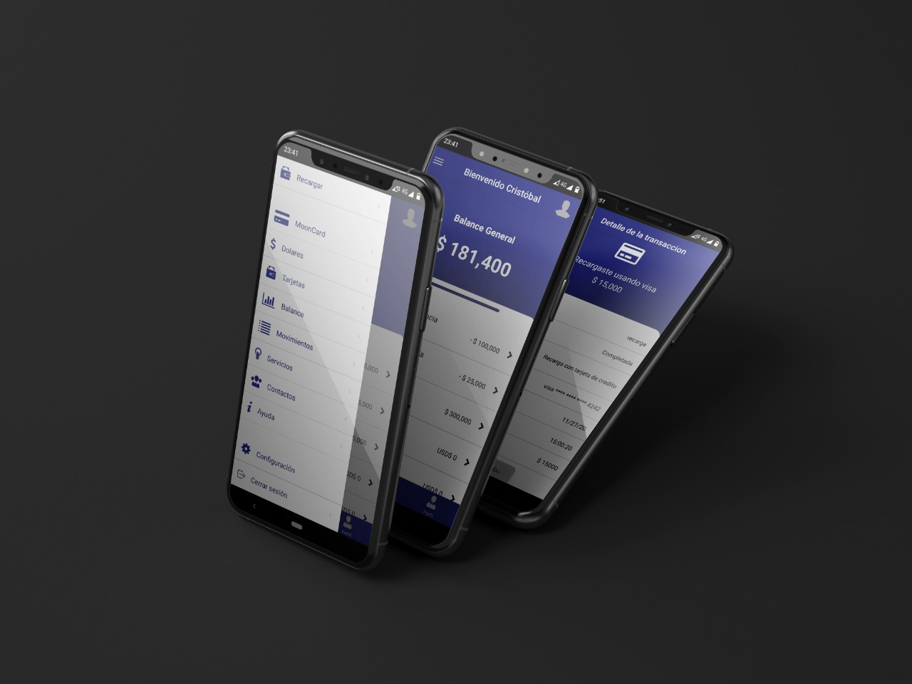

# Wellcome to Moonbank 
 


## Virtual Wallet with Firebase and React-Native

### Installation

`npm i` / `npm install`

### Visualization

`npm start`

You can run the App in four ways:

- In the ExpoGo app on your Phone _(Downloading the Expo App from PlayStore and read the QR code)_
- Your Web Browser _(`expo start`)_
- An Android simulator like Android Studio or Visor _(`expo start`)_
- Download the apk [MoonBank](https://expo.io/artifacts/2765fdbf-7b2d-4f5b-a16b-ab77f67498a6) app

---

### Extra Configuration [ only if you want to run the App on the Web browser _(*_Not recommended_*)_ ]

Go to the following route in node_modules and edit the FlipCard.js file with this changes:

> `node_modules\react-native-flip-card\lib\FlipCard.js`

1. Paste on the top this code:

```javascript
import * as ReactNative from "react-native-web";
const PropTypes = require("prop-types");
ReactNative.Text.propTypes = { style: PropTypes.any };
ReactNative.View.propTypes = { style: PropTypes.any };
ReactNative.Image.propTypes = { style: PropTypes.any };
ReactNative.ViewPropTypes = { style: PropTypes.any };
```

2. Comment the following line:

```javascript
import PropTypes from "prop-types";
```

```javascript
//import PropTypes from "prop-types";
```
------------


#### 📹 Workflow video of [MoonBank Wallet](https://youtu.be/L2yQqAn2gy4)

<a href='https://youtu.be/L2yQqAn2gy4' target='_blank'>
  
</a>

### Some Images from our proyect
<table align="center">
  <tr>
    <td>Login View</td>
     <td>Home Screen</td>
     <td>Side Menu</td>
  </tr>
  <tr>
    <td></td>
    <td></td>
    <td></td>
  </tr>
  </table>
  <table  align="center">
   <tr>
    <td>Dark Mode</td>
     <td>Transfers</td>
     <td>Graph of your movements.</td>
  </tr>
  <tr>
  <td></td>
    <td></td>
    <td></td>
  </tr>
  </table>
  <table  align="center">
   <tr>
    <td> MoonBank Card.</td>
     <td>Contacts in the app.</td>
     <td>Add your fingerprint and more..</td>
  </tr>
  <tr>
    <td></td>
    <td></td>
    <td></td>
  </tr>
 </table>

